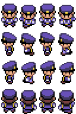

# Config

In this file will be located some global constants available in all the project.

## General constants

### `GAME_CANVAS_SIZE`

A tuple of two number corresponding to the width and the height in pixels (in that order)
of the canvas draw in the app. It will be convenient that the size of the canvas be a multiple
of the `CELL_SIZE`.

Default = `[576, 384]`

### `CELL_SIZE`

The size of the cells in pixels. <b>Game Maps</b> will be divided in cells with the specified
size in this constant. In fact, the minimum unit of measurement of the movement of <b>Characters</b>
are cells, so that the minimum movement of a character will be a cell.

This constant is a single number since cells must be square, so it will represent both the width
and the height of the cell.

Defalt = `32`

### `KEYBOARD_INPUT_MAP`

Map keystrokes to the <b>InputState</b>. Currently, we just have 6 inputs in our <b>InputState</b>,
one per each direction (UP, DOWN, LEFT and RIGHT) and another two inputs for Accept or Cancel actions.

For example, in order to move the character, we'll check the direction inputs, and to close a text box,
we'll check the accept input.

In short, this constant determines which keyboard keys are mapped with certain inputs. Since it is
an array, it could be more than one per action.

Default:

```ts
{
  UP: [Key.ArrowUp],
  DOWN: [Key.ArrowDown],
  LEFT: [Key.ArrowLeft],
  RIGHT: [Key.ArrowRight],
  ACCEPT: [Key.Enter],
  CANCEL: [Key.Escape]
}
```

## Character constants

### `CHARACTER_RESOURCE`

Determines which file contains the sprites of the <b>Character</b> controlled by the player.
Character sprites image should be a grid of 4x4.

Character resource should be placed inside the `public` folder.

Character resource should be a grid of 4x4 in order to animate properly the character movement.
The default character resource should be like this:



### `CHARACTER_HEIGHT`

Determines the height in pixels of a character single sprite. If the character height is
48, the resource located in `CHARACTER_RESOURCE` should have a height of 192px. (4x48), since
each row should correspond to an animation.

Default: `48`

### `CHARACTER_WIDTH`

Determines the width in pixels of a character single sprite. If the character width is
32, the resource located in `CHARACTER_RESOURCE` should have a width of 128px. (4x32), since
each row should correspond to an animation.

Default: `32`

### `CHARACTER_SPEED`

Determines the time it takes for a character to advance the minimum unit of movement, which is a cell.

Default: `0.3`

### `CHARACTER_ANIMATION_SPEED`

Determines how fast the animation is running. The greatest this number, the faster the animation will run.

Default: `4`;

### `CHARACTER_ANIMATION_MAP`

A Map containing the frames of the animation and the X position of the animations. This constant assumes that
the `CHARACTER_RESOURCE` will follow the same structure as the default one. (See `CHARACTER_RESOURCE`).
So, this constant will map a Frame with a X Offset of the `CHARACTER_RESOURCE` to indicate to the
character canvas how to render it. By default, Character animation just have 4 frames, should this map will have
a size of 4.

Default:

```ts
{
  [1, 0], [2, -32], [3, -64], [4, -96];
}
```

If you notice, in each frame the character width is added.

## Map constants

### `MAP_RESOURCE_PREFIX`

Maps should be an image. This constant determines the prefix of the map resources, since the
name of maps should be this prefix following the map id. For example, if the id of the map is 0,
the image must be named `map_0` if this value is `map_0`.

Default: `map_`

### `MAP_RESOURCE_EXTENSION`

Determines the extension of the maps images.

Default: `.jpeg`

## UI constants

### `TEXTBOX_HEIGHT`

Determines the height in pixels of the Text box. Text boxes are shown, for example, when an event has the
`ShowMessage` action.

Default: `60`

### `TEXTBOX_WIDTH`

Determines the width in pixels of the Text box. Text boxes are shown, for example, when an event has the
`ShowMessage` action.

Default: `500`

### `TEXTBOX_BORDER_RADIUS`

Determines the border radius in pixels of the text box. The higher number, the rounder Text box.

Default: `8`

### `TEXTBOX_PADDING`

Determines the space in pixels between the text inside the Text box and the borders of the box.

Default: `8`
